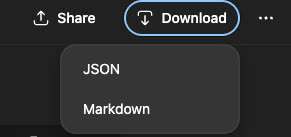

# ChatGPT Save

Effortlessly capture any ChatGPT conversation as a tidy JSON payload or a ready-to-share Markdown transcript—right from the conversation view.

## Features
- **One-click export** – Adds a “Download” button alongside ChatGPT’s native Share action.
- **Two formats** – Choose between the raw OpenAI conversation JSON or a clean Markdown transcript.
- **Native look & feel** – UI mirrors ChatGPT styling so it blends in naturally.
- **Zero extra auth** – Reuses your existing session; no additional credentials required.

## Installation (Unpacked)
1. Open Chrome and navigate to `chrome://extensions`.
2. Toggle **Developer mode** on (top-right).
3. Click **Load unpacked** and select the repository folder.
4. Ensure the newly added “ChatGPT Save” extension is enabled.

## Usage
1. Visit any ChatGPT conversation at `https://chatgpt.com`.
2. Click the new **Download** button next to “Share”.
3. Pick **JSON** or **Markdown** from the dropdown.
4. The file downloads instantly to your browser’s default download location.

## How It Works
When you request a download, the extension replays the conversation fetch against ChatGPT’s backend while authenticated with your existing session. The raw JSON response can be saved directly, or run through a lightweight parser to produce Markdown. No credentials leave the browser, and nothing is scraped from the DOM.
